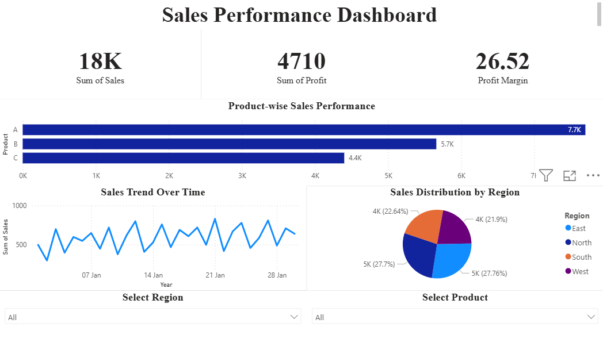

# Sales Performance Dashboard (Power BI)

## 📊 Project Overview

This project is a Sales Performance Dashboard built using Power BI. It provides insights into sales trends, product performance, and regional distribution.

## 🚀 Features

* KPI Cards (Total Sales, Total Profit, Profit Margin)
* Sales Trend Analysis (Line Chart)
* Product-wise Sales Comparison (Bar Chart)
* Regional Sales Distribution (Pie Chart)
* Interactive Filters (Region & Product)

## 🛠️ Tools Used

* Power BI
* Excel

## 📁 Files

* `sales_dashboard.pbix` → Power BI dashboard
* `sales_data.xlsx` → Dataset used

## 📌 Insights

* Identified top-performing products
* Analyzed regional contribution to total sales
* Observed sales trends over time

## 💡 Future Improvements

* Add advanced DAX measures
* Integrate real-time data source
* Enhance UI design

## 📷 Dashboard Preview

